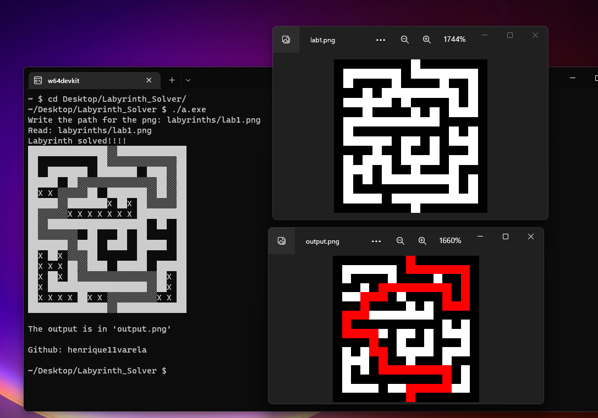

# Labyrinth_Solver

A labyrinth solver

The input is a PNG of a labyrinth where **white** is a path and **black** is a wall.

It outputs the shortest solved path.

Largest file 40x40px

# What does it do?

1. Asks for the Path of the PNG image and loads it.
2. Translates from pixel information to a 2D array using `1` as a Wall (Black) and `0` as Ground (White).
3. Looks for a `0` in the 2D array's border and saves its coordinates.
4. Starting with the coordinates found in step 3. Recursively, it lays "bread crumbs" in the form of a number starting in 10 and incrementing for each step it takes away from the entrance, testing every path.
5. Looks for the highest value in the 2D array's border and saves its coordinates.
6. Starting with the coordinates found in step 5. Again recursively, it lays `9`s and follows the next (non 1) lower value until it reaches `10`.
7. Displays on the screen the solved labyrinth.
8. Exports a PNG image of the solved labyrinth with the path marked in red.
